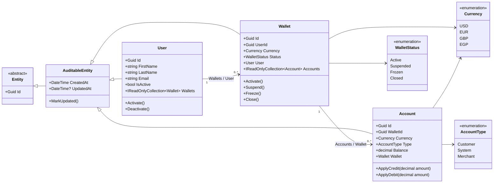

# FinPay Domain Entity Relationships

This document describes the current relationships among `User`, `Wallet`, and
`Account`, including their identifiers, foreign keys, navigation properties,
and the enums they use.



## Identifier and key mapping

`User`, `Wallet`, and `Account` inherit their primary key from `Entity` through
`AuditableEntity`:

```csharp
public Guid Id { get; protected set; } = Guid.NewGuid();
```

| Entity | Primary key | Foreign key | References |
| --- | --- | --- | --- |
| `User` | `Id` | — | — |
| `Wallet` | `Id` | `UserId` | `User.Id` |
| `Account` | `Id` | `WalletId` | `Wallet.Id` |

Therefore:

```text
Wallet.UserId      -> User.Id
Account.WalletId   -> Wallet.Id
```

`Wallet` does not currently have a property named `UserGuid`; the `UserId`
property is the GUID foreign-key property by naming convention. The `User`
property is its navigation property. Likewise, `Account.WalletId` is the
foreign-key property and `Account.Wallet` is its navigation property.

In Entity Framework Core, these names conventionally map to database foreign
keys. A database-level foreign-key constraint is created when the relationship
is included in the EF Core model and a migration is applied.

## Relationship cardinality

- One `User` can own zero or more `Wallet` instances.
- One `Wallet` belongs to exactly one `User` through `UserId`.
- One `Wallet` can contain zero or more `Account` instances.
- One `Account` belongs to exactly one `Wallet` through `WalletId`.
