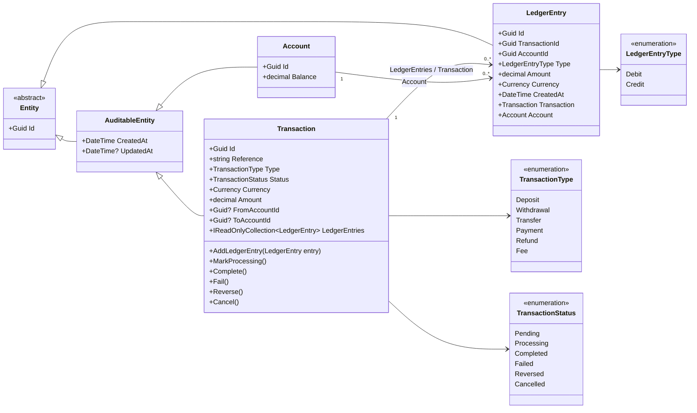
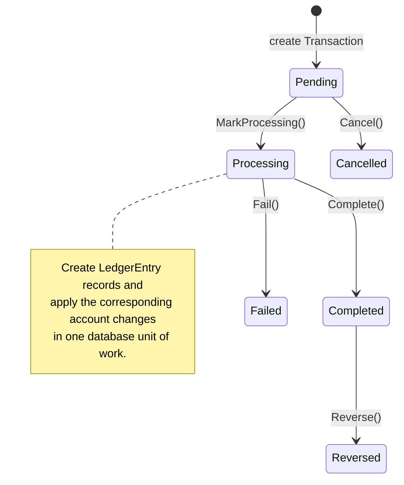

# Transaction and Ledger Cycle

## What is a ledger entry?

A `LedgerEntry` is an immutable-style accounting record for one effect of a
financial transaction on one account. It answers:

> For this transaction, which account was affected, by what amount and
> currency, and was the entry a debit or a credit?

`Transaction` represents the business operation (for example, a transfer or
payment). `LedgerEntry` represents the accounting postings produced by that
operation. One transaction can have multiple ledger entries; this is what makes
it possible to record both sides of a transfer.

The current class does not expose methods that alter its amount, type, account,
or transaction after it is created. This is a useful ledger characteristic:
the record should remain an audit trail. If a completed transaction must be
undone, the normal accounting approach is to create compensating entries as part
of a reversal, rather than editing the original entries.

## Entity relationship

## Keys and navigation properties

| Entity | Primary key | Foreign keys | Navigation properties |
| --- | --- | --- | --- |
| `Transaction` | `Id` | `FromAccountId` and `ToAccountId` are optional account references | `FromAccount`, `ToAccount`, `LedgerEntries` |
| `LedgerEntry` | `Id` | `TransactionId` → `Transaction.Id`; `AccountId` → `Account.Id` | `Transaction`, `Account` |
| `Account` | `Id` | — | Not yet a `LedgerEntries` collection in the class |

`TransactionId` and `AccountId` are the ledger entry's foreign-key properties.
The `Transaction` and `Account` properties are their object navigation
properties. Entity Framework Core can map these as foreign keys by convention
once these entities and relationships are included in its model.

## Lifecycle

The methods currently permit calling a later status method without enforcing
the arrows above. The diagram shows the intended financial workflow; explicit
state-transition checks would be needed to enforce it in code.

## Example: transfer posting

For a transfer of `100 EGP` from Account A to Account B, the transaction would
typically have two ledger entries:

| Ledger entry | Account | Amount | Type |
| --- | --- | ---: | --- |
| Entry 1 | Account A | 100 EGP | Debit or Credit, according to the chosen accounting convention |
| Entry 2 | Account B | 100 EGP | The opposite type |

The current model defines the `Debit` and `Credit` labels but does not define
which label increases an account balance. Establish that rule once, document
it, and apply it consistently when creating entries and calling
`Account.ApplyDebit` / `Account.ApplyCredit`.

## Suggested processing order

1. Create the `Transaction` in `Pending` status.
2. Move it to `Processing`.
3. Validate the source account, destination account, amount, and currency.
4. Create balanced `LedgerEntry` records for every affected account.
5. Apply matching balance changes to the accounts.
6. Save the transaction, ledger entries, and account changes atomically.
7. Mark the transaction `Completed`; mark it `Failed` if processing cannot be completed.

For a reversal, create opposite ledger entries and corresponding account changes,
then set the original transaction status to `Reversed`.
